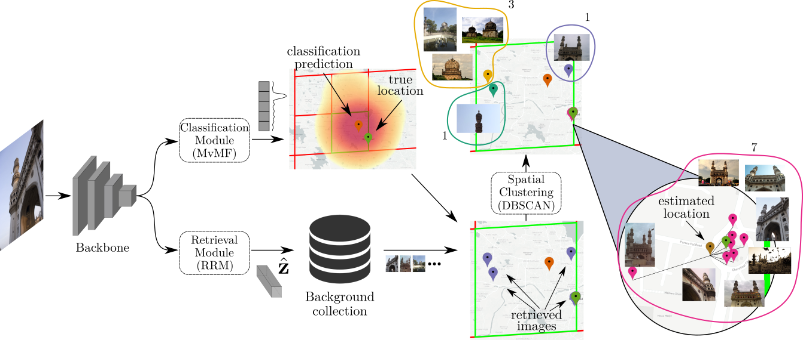

# Visual location estimation
This repository contains the PyTorch implementation of the papers 
[Leveraging EfficientNet and Contrastive Learning for Accurate Global-scale Location Estimation](https://dl.acm.org/doi/abs/10.1145/3460426.3463644)
and [Leveraging Selective Prediction for Reliable Image Geolocation](https://link.springer.com/chapter/10.1007/978-3-030-98355-0_31). 
It provides all necessary code and pre-trained models for the evaluation of the location estimation method on the 
datasets presented in the paper to facilitate the reproducibility of the results. It provides code for the 
Search within Cell (SwC) scheme for the accurate location prediction, and the calculation of the Prediction Density (PD) 
that indicates image localizability.




## Prerequisites
* Python 3
* PyTorch
* Torchvision

## Preparation

### Installation

* Clone this repo:
```bash
git clone https://github.com/mever-team/distill-and-select
cd distill-and-select
```
* Install all the dependencies by
```bash
pip install -r requirements.txt
```

### Background collection
* Download and store the features of the background collection needed for SwC inference from 
[here](https://mever.iti.gr/visloc/back_coll_features.hdf5) or by
```bash
wget https://mever.iti.gr/visloc/back_coll_features.hdf5
```

### Evaluation datasets
* Follow the instructions in the original repos to download the evaluation datasets
  * [Im2GPS](http://graphics.cs.cmu.edu/projects/im2gps/)
  * [Im2GPS3k,YFCC4k](https://github.com/lugiavn/revisiting-im2gps/)
  * [YFCC25k](https://github.com/TIBHannover/GeoEstimation)

## Evaluation
* To evaluate the approach, run the `evaluation.py` script given the `dataset` you wand to evaluate on, 
the `image_folder` directory of the dataset images, and the `background` path of the background collection features
```bash
python evaluation.py  --dataset im2gps3k --image_folder <path_to_images> --background ./back_coll_features.hdf5
```

* The script above calculates the geolocation accuracy for the provided `evaluation_radius`. It provides results for 
the entire dataset and the dataset split of localizable and non-localizable based on the provided PD value.

* Change the values of `top_k` and `eps` to parametrize DBSCAN clustering of the SwC process.

* Change the values of `conf_thres` and `conf_scale` to parametrize the PD that determines which images are considered 
localizable and non-localizable.

## Inference
* You can also use the code to predict the location of a single image

* Run the `inference.py` script given the `image_path` of an image stored locally or the `image_url` of an image from 
the web
```bash
python inference.py --image_url 'https://upload.wikimedia.org/wikipedia/commons/thumb/a/a8/Tour_Eiffel_Wikimedia_Commons.jpg/200px-Tour_Eiffel_Wikimedia_Commons.jpg'
```

## Citation
If you use this code for your research, please consider citing our papers:
```bibtex
@inproceedings{kordopatis2021leveraging,
  title={Leveraging efficientnet and contrastive learning for accurate global-scale location estimation},
  author={Kordopatis-Zilos, Giorgos and Galopoulos, Panagiotis and Papadopoulos, Symeon and Kompatsiaris, Ioannis},
  booktitle={Proceedings of the International Conference on Multimedia Retrieval},
  year={2021}
}

@inproceedings{panagiotopoulos2022leveraging,
  title={Leveraging Selective Prediction for Reliable Image Geolocation},
  author={Panagiotopoulos, Apostolos and Kordopatis-Zilos, Giorgos and Papadopoulos, Symeon},
  booktitle={Proceedings of the International Conference on MultiMedia Modeling},
  year={2022},
}
```
